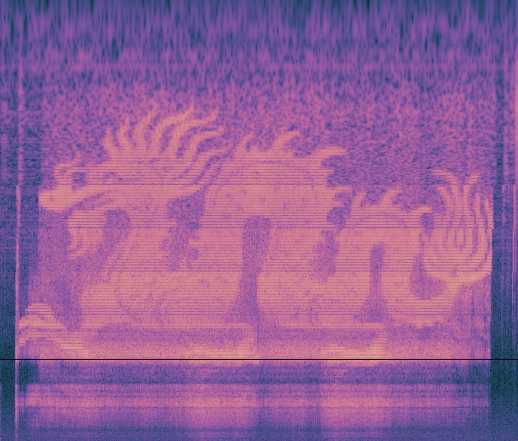
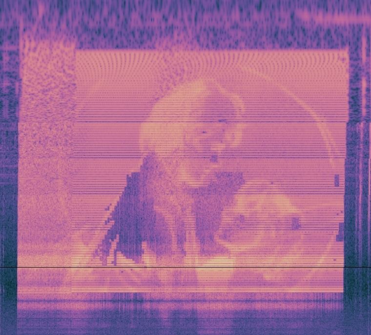
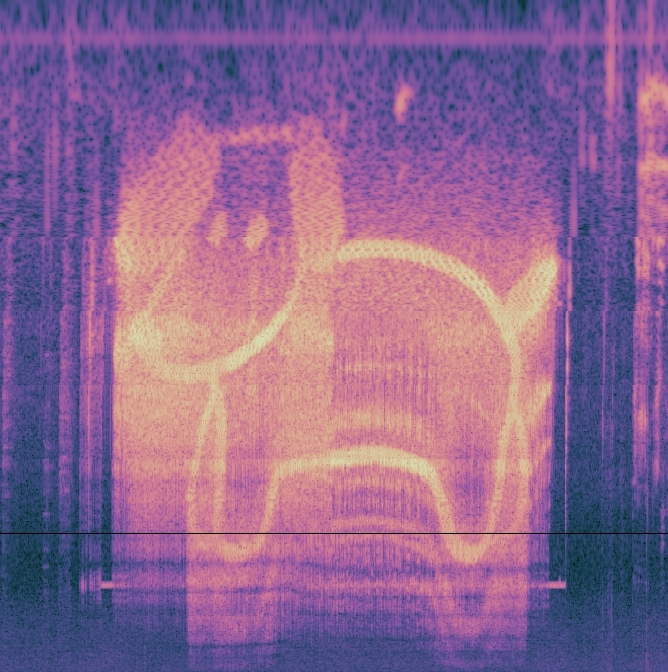
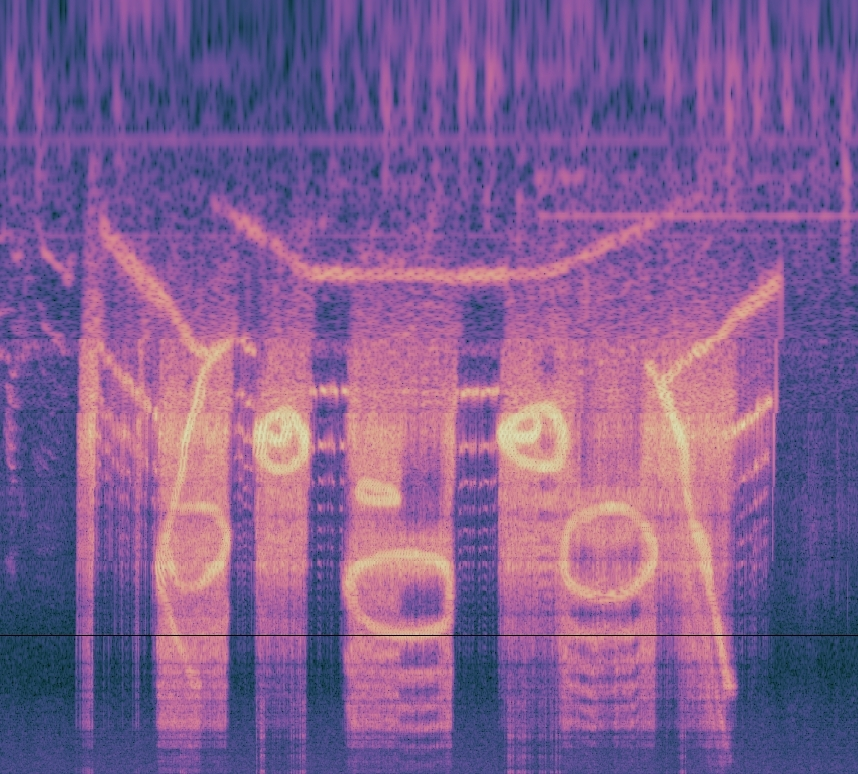
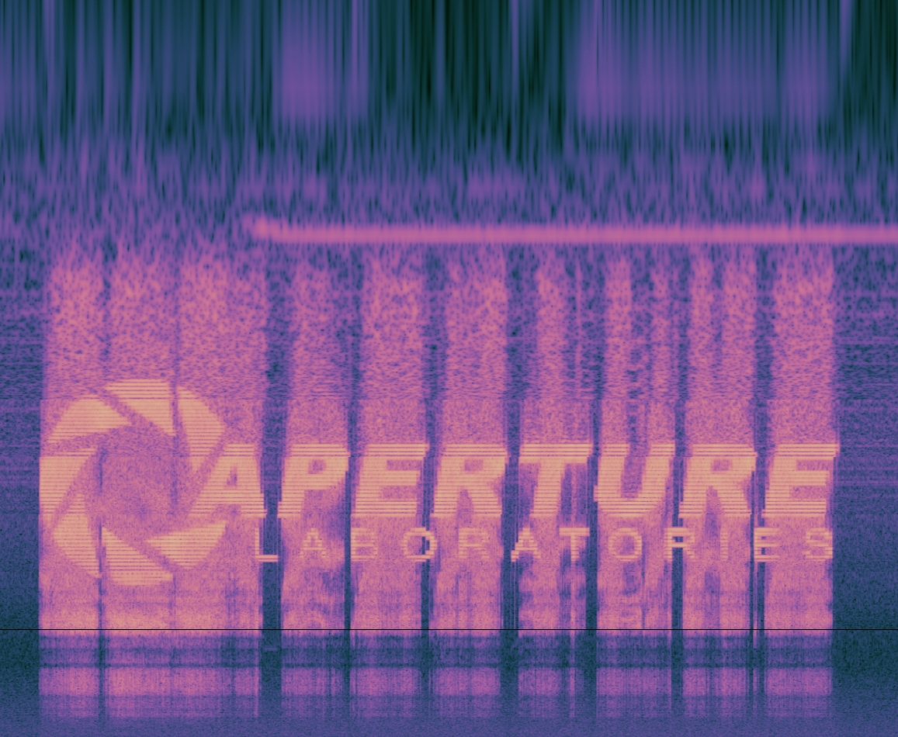
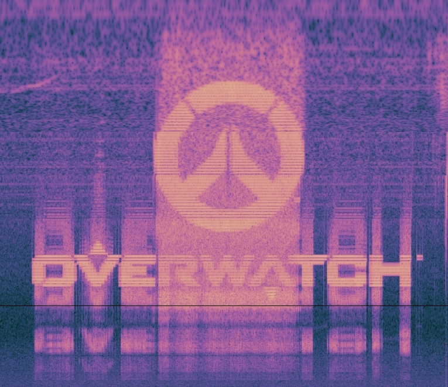
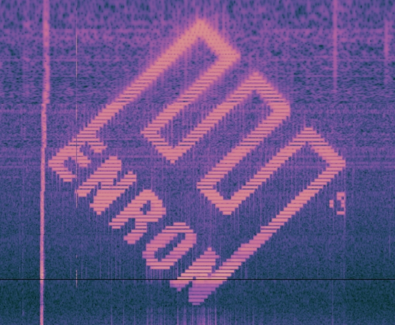
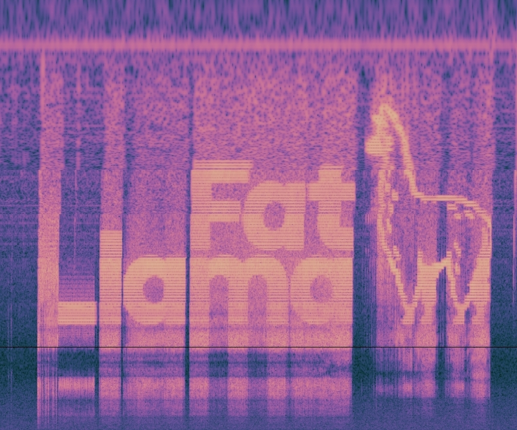

# sounds

Turn images into sounds viewable on a [spectrogram](https://en.wikipedia.org/wiki/Spectrogram)!

The idea isn't that new—[Aphex Twin](https://www.youtube.com/watch?v=M9xMuPWAZW8&t=330s) did this in 1999, and people have been doing it [manually with whistle/voice](https://www.youtube.com/watch?v=PHIGke6Yzh8) since at least 2009.

This program is written using [Processing](https://processing.org/) and depends on the [processing-sound](https://github.com/processing/processing-sound) library, which you will need to install before running.

For visualizations, I played sounds through my PC speakers and used the [Spectroid](https://play.google.com/store/apps/details?id=org.intoorbit.spectrum&hl=en_US) Android app.

## Examples
| | |
|:-------------------------:|:-------------------------:|
|||
||

Logos in particular end up looking really awesome and dystopian:

| | |
|:-------------------------:|:-------------------------:|
|||
||

## Tunable parameters
| Parameter | Description |
| --- | --- |
| `timeDelta` | Milliseconds to spend on each column of the image; scales the image horizontally |
| `resolution` | Number of vertical "pixels" the image should have. Higher values tend to have more noise |
| `logFreqStart` | Lower bound, as a power of 10, of the frequency the program can emit |
| `logFreqEnd` | Upper bound of the frequency |

Note that this is built with a log-scaled spectrogram in mind. If yours is linearly scaled, then edit [this line](https://github.com/veggiedefender/sounds/blob/0037fe4261483db4ff1666025c9213bb9e776c0d/sounds.pde#L20) to accommodate your needs.
